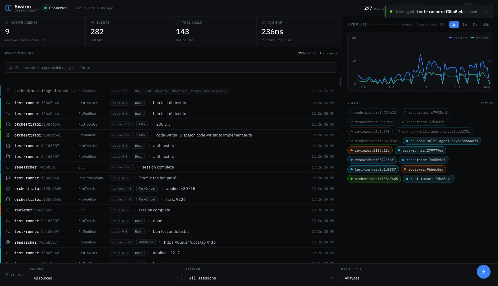
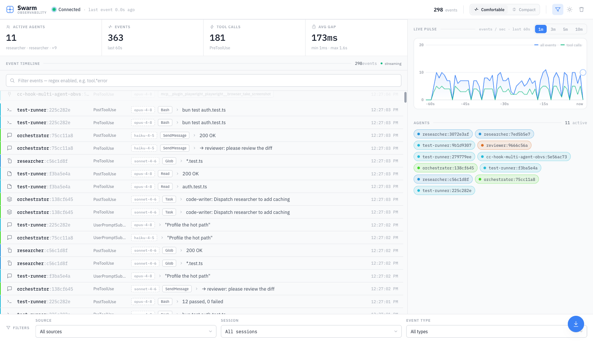

# Multi-Agent Observability System

Real-time monitoring and visualization for Claude Code agents through comprehensive hook event tracking. Watch the [latest deep dive on multi-agent orchestration with Opus 4.6 here](https://youtu.be/RpUTF_U4kiw). With Claude Opus 4.6 and multi-agent orchestration, you can now spin up teams of specialized agents that work in parallel, and this observability system lets you trace every tool call, task handoff, and agent lifecycle event across the entire swarm.

## 🎯 Overview

This system provides complete observability into Claude Code agent behavior by capturing, storing, and visualizing Claude Code [Hook events](https://docs.anthropic.com/en/docs/claude-code/hooks) in real-time. It enables monitoring of multiple concurrent agents with session tracking, event filtering, and live updates. 



### ✨ Redesigned UI

A dense, dark-first **"precision instrument"** client: flat token-driven surfaces, IBM Plex Sans/Mono with tabular figures, a unified line-icon set (no emoji), a real labelled-axis live-pulse chart, per-agent swim lanes, inline human-in-the-loop approvals, and 13 fully-themed palettes.


<details>
<summary><b>Light theme</b> — every surface is token-driven, so all 13 themes adapt</summary>

<br>



</details>

## 🏗️ Architecture

```
Claude Agents → Hook Scripts → HTTP POST → Bun Server → SQLite → WebSocket → Vue Client
```


## 📋 Setup Requirements

Before getting started, ensure you have the following installed:

- **[Claude Code](https://docs.anthropic.com/en/docs/claude-code)** - Anthropic's official CLI for Claude
- **[Astral uv](https://docs.astral.sh/uv/)** - Fast Python package manager (required for hook scripts)
- **[Bun](https://bun.sh/)**, **npm**, or **yarn** - For running the server and client
- **[just](https://github.com/casey/just)** (optional) - Command runner for project recipes
- **Anthropic API Key** - Set as `ANTHROPIC_API_KEY` environment variable
- **OpenAI API Key** (optional) - For multi-model support with just-prompt MCP tool
- **ElevenLabs API Key** (optional) - For audio features
- **Firecrawl API Key** (optional) - For web scraping features

### Configure .claude Directory

To setup observability in your repo,we need to copy the .claude directory to your project root.

To integrate the observability hooks into your projects:

1. **Copy the entire `.claude` directory to your project root:**
   ```bash
   cp -R .claude /path/to/your/project/
   ```

2. **Update the `settings.json` configuration:**
   
   Open `.claude/settings.json` in your project and modify the `source-app` parameter to identify your project:
   
   ```json
   {
     "hooks": {
       "PreToolUse": [{
         "matcher": "",
         "hooks": [
           {
             "type": "command",
             "command": "uv run .claude/hooks/pre_tool_use.py"
           },
           {
             "type": "command",
             "command": "uv run .claude/hooks/send_event.py --source-app YOUR_PROJECT_NAME --event-type PreToolUse --summarize"
           }
         ]
       }],
       "PostToolUse": [{
         "matcher": "",
         "hooks": [
           {
             "type": "command",
             "command": "uv run .claude/hooks/post_tool_use.py"
           },
           {
             "type": "command",
             "command": "uv run .claude/hooks/send_event.py --source-app YOUR_PROJECT_NAME --event-type PostToolUse --summarize"
           }
         ]
       }],
       "UserPromptSubmit": [{
         "hooks": [
           {
             "type": "command",
             "command": "uv run .claude/hooks/user_prompt_submit.py --log-only"
           },
           {
             "type": "command",
             "command": "uv run .claude/hooks/send_event.py --source-app YOUR_PROJECT_NAME --event-type UserPromptSubmit --summarize"
           }
         ]
       }]
       // ... (similar patterns for all 12 hook events: Notification, Stop, SubagentStop,
      //      SubagentStart, PreCompact, SessionStart, SessionEnd, PermissionRequest, PostToolUseFailure)
     }
   }
   ```
   
   Replace `YOUR_PROJECT_NAME` with a unique identifier for your project (e.g., `my-api-server`, `react-app`, etc.).

3. **Ensure the observability server is running:**
   ```bash
   # From the observability project directory (this codebase)
   ./scripts/start-system.sh
   ```

Now your project will send events to the observability system whenever Claude Code performs actions.

## 🚀 Quick Start

You can quickly view how this works by running this repository's `.claude` setup.

```bash
# 1. Start both server and client
just start          # or: ./scripts/start-system.sh

# 2. Open http://localhost:5173 in your browser

# 3. Open Claude Code and run the following command:
Run git ls-files to understand the codebase.

# 4. Watch events stream in the client

# 5. Copy the .claude folder to other projects you want to emit events from.
cp -R .claude <directory of your codebase you want to emit events from>
```

### Using `just` (Recommended)

A `justfile` provides convenient recipes for common operations:

```bash
just              # List all available recipes
just start        # Start server + client
just stop         # Stop all processes
just restart      # Stop then start
just server       # Start server only (dev mode)
just client       # Start client only
just install      # Install all dependencies
just health       # Check server/client status
just test-event   # Send a test event
just db-reset     # Reset the database
just hooks        # List all hook scripts
just open         # Open dashboard in browser
```

## 📁 Project Structure

```
claude-code-hooks-multi-agent-observability/
│
├── apps/                    # Application components
│   ├── server/             # Bun TypeScript server
│   │   ├── src/
│   │   │   ├── index.ts    # Main server with HTTP/WebSocket endpoints
│   │   │   ├── db.ts       # SQLite database management & migrations
│   │   │   └── types.ts    # TypeScript interfaces
│   │   ├── package.json
│   │   └── events.db       # SQLite database (gitignored)
│   │
│   └── client/             # Vue 3 TypeScript client
│       ├── src/
│       │   ├── App.vue     # Main app with theme & WebSocket management
│       │   ├── components/
│       │   │   ├── EventTimeline.vue      # Event list with auto-scroll
│       │   │   ├── EventRow.vue           # Individual event display
│       │   │   ├── FilterPanel.vue        # Multi-select filters
│       │   │   ├── ChatTranscriptModal.vue # Chat history viewer
│       │   │   ├── StickScrollButton.vue  # Scroll control
│       │   │   └── LivePulseChart.vue     # Real-time activity chart
│       │   ├── composables/
│       │   │   ├── useWebSocket.ts        # WebSocket connection logic
│       │   │   ├── useEventColors.ts      # Color assignment system
│       │   │   ├── useChartData.ts        # Chart data aggregation
│       │   │   └── useEventEmojis.ts      # Event type emoji mapping
│       │   ├── utils/
│       │   │   └── chartRenderer.ts       # Canvas chart rendering
│       │   └── types.ts    # TypeScript interfaces
│       ├── .env.sample     # Environment configuration template
│       └── package.json
│
├── .claude/                # Claude Code integration
│   ├── hooks/             # Hook scripts (Python with uv)
│   │   ├── send_event.py          # Universal event sender (all 12 event types)
│   │   ├── pre_tool_use.py        # Tool validation, blocking & summarization
│   │   ├── post_tool_use.py       # Result logging with MCP tool detection
│   │   ├── post_tool_use_failure.py # Tool failure logging
│   │   ├── permission_request.py  # Permission request logging
│   │   ├── notification.py        # User interaction events (type-aware TTS)
│   │   ├── user_prompt_submit.py  # User prompt logging & validation
│   │   ├── stop.py               # Session completion (stop_hook_active guard)
│   │   ├── subagent_stop.py      # Subagent completion with transcript path
│   │   ├── subagent_start.py     # Subagent lifecycle start tracking
│   │   ├── pre_compact.py        # Context compaction with custom instructions
│   │   ├── session_start.py      # Session start with agent type & model
│   │   ├── session_end.py        # Session end with reason tracking
│   │   └── validators/           # Stop hook validators
│   │       ├── validate_new_file.py     # Validate file creation
│   │       └── validate_file_contains.py # Validate file content sections
│   │
│   ├── agents/team/       # Agent team definitions
│   │   ├── builder.md     # Engineering agent with linting hooks
│   │   └── validator.md   # Read-only validation agent
│   │
│   ├── commands/          # Custom slash commands
│   │   └── plan_w_team.md # Team-based planning command
│   │
│   ├── status_lines/      # Status line scripts
│   │   └── status_line_v6.py # Context window usage display
│   │
│   └── settings.json      # Hook configuration (all 12 events)
│
├── justfile               # Task runner recipes (just start, just stop, etc.)
│
├── scripts/               # Utility scripts
│   ├── start-system.sh   # Launch server & client
│   ├── reset-system.sh   # Stop all processes
│   └── test-system.sh    # System validation
│
└── logs/                 # Application logs (gitignored)
```

## 🔧 Component Details

### 1. Hook System (`.claude/hooks/`)

> If you want to master claude code hooks watch [this video](https://github.com/disler/claude-code-hooks-mastery)

The hook system intercepts Claude Code lifecycle events:

- **`send_event.py`**: Core script that sends event data to the observability server
  - Supports all 12 hook event types with event-specific field forwarding
  - Supports `--add-chat` flag for including conversation history
  - Forwards event-specific fields (`tool_name`, `tool_use_id`, `agent_id`, `notification_type`, etc.) as top-level properties for easier querying
  - Validates server connectivity before sending

- **Event-specific hooks** (12 total): Each implements validation and data extraction
  - `pre_tool_use.py`: Blocks dangerous commands, validates tool usage, summarizes tool inputs per tool type
  - `post_tool_use.py`: Captures execution results with MCP tool detection (`mcp_server`, `mcp_tool_name`)
  - `post_tool_use_failure.py`: Logs tool execution failures
  - `permission_request.py`: Logs permission request events
  - `notification.py`: Tracks user interactions with `notification_type`-aware TTS (permission_prompt, idle_prompt, etc.)
  - `user_prompt_submit.py`: Logs user prompts, supports validation with JSON `{"decision": "block"}` pattern
  - `stop.py`: Records session completion with `stop_hook_active` guard to prevent infinite loops
  - `subagent_stop.py`: Monitors subagent task completion with transcript path tracking
  - `subagent_start.py`: Tracks subagent lifecycle start events
  - `pre_compact.py`: Tracks context compaction with custom instructions in backup filenames
  - `session_start.py`: Logs session start with `agent_type`, `model`, and `source` fields
  - `session_end.py`: Logs session end with reason tracking (including `bypass_permissions_disabled`)

### 2. Server (`apps/server/`)

Bun-powered TypeScript server with real-time capabilities:

- **Database**: SQLite with WAL mode for concurrent access
- **Endpoints**:
  - `POST /events` - Receive events from agents
  - `GET /events/recent` - Paginated event retrieval with filtering
  - `GET /events/filter-options` - Available filter values
  - `WS /stream` - Real-time event broadcasting
- **Features**:
  - Automatic schema migrations
  - Event validation
  - WebSocket broadcast to all clients
  - Chat transcript storage

### 3. Client (`apps/client/`)

Vue 3 application with real-time visualization:

- **Visual Design**:
  - Dual-color system: App colors (left border) + Session colors (second border)
  - Gradient indicators for visual distinction
  - Dark/light theme support
  - Responsive layout with smooth animations

- **Features**:
  - Real-time WebSocket updates
  - Multi-criteria filtering (app, session, event type)
  - Live pulse chart with session-colored bars and event type indicators
  - Time range selection (1m, 3m, 5m) with appropriate data aggregation
  - Chat transcript viewer with syntax highlighting
  - Auto-scroll with manual override
  - Event limiting (configurable via `VITE_MAX_EVENTS_TO_DISPLAY`)

- **Tool Emoji System**:
  - Each tool type has a dedicated emoji (Bash: 💻, Read: 📖, Write: ✍️, Edit: ✏️, Task: 🤖, etc.)
  - Tool events show combo emojis: event emoji + tool emoji (e.g., 🔧💻 for PreToolUse:Bash)
  - MCP tools display with 🔌 prefix
  - Tool name badge displayed alongside event type in the timeline

- **Live Pulse Chart**:
  - Canvas-based real-time visualization
  - Session-specific colors for each bar
  - Event type + tool combo emojis displayed on bars
  - Smooth animations and glow effects
  - Responsive to filter changes

## 🔄 Data Flow

1. **Event Generation**: Claude Code executes an action (tool use, notification, etc.)
2. **Hook Activation**: Corresponding hook script runs based on `settings.json` configuration
3. **Data Collection**: Hook script gathers context (tool name, inputs, outputs, session ID)
4. **Transmission**: `send_event.py` sends JSON payload to server via HTTP POST
5. **Server Processing**:
   - Validates event structure
   - Stores in SQLite with timestamp
   - Broadcasts to WebSocket clients
6. **Client Update**: Vue app receives event and updates timeline in real-time

## 🎨 Event Types & Visualization

| Event Type         | Emoji | Purpose                | Color Coding  | Special Display                      |
| ------------------ | ----- | ---------------------- | ------------- | ------------------------------------ |
| PreToolUse         | 🔧     | Before tool execution  | Session-based | Tool name + tool emoji & details     |
| PostToolUse        | ✅     | After tool completion  | Session-based | Tool name + tool emoji & results     |
| PostToolUseFailure | ❌     | Tool execution failed  | Session-based | Error details & interrupt status     |
| PermissionRequest  | 🔐     | Permission requested   | Session-based | Tool name & permission suggestions   |
| Notification       | 🔔     | User interactions      | Session-based | Notification message & type          |
| Stop               | 🛑     | Response completion    | Session-based | Summary & chat transcript            |
| SubagentStart      | 🟢     | Subagent started       | Session-based | Agent ID & type                      |
| SubagentStop       | 👥     | Subagent finished      | Session-based | Agent details & transcript path      |
| PreCompact         | 📦     | Context compaction     | Session-based | Trigger & custom instructions        |
| UserPromptSubmit   | 💬     | User prompt submission | Session-based | Prompt: _"user message"_ (italic)    |
| SessionStart       | 🚀     | Session started        | Session-based | Source, model & agent type           |
| SessionEnd         | 🏁     | Session ended          | Session-based | End reason (clear/logout/exit/other) |

### UserPromptSubmit Event (v1.0.54+)

The `UserPromptSubmit` hook captures every user prompt before Claude processes it. In the UI:
- Displays as `Prompt: "user's message"` in italic text
- Shows the actual prompt content inline (truncated to 100 chars)
- Summary appears on the right side when AI summarization is enabled
- Useful for tracking user intentions and conversation flow

## 🔌 Integration

### For New Projects

1. Copy the event sender:
   ```bash
   cp .claude/hooks/send_event.py YOUR_PROJECT/.claude/hooks/
   ```

2. Add to your `.claude/settings.json`:
   ```json
   {
     "hooks": {
       "PreToolUse": [{
         "matcher": ".*",
         "hooks": [{
           "type": "command",
           "command": "uv run .claude/hooks/send_event.py --source-app YOUR_APP --event-type PreToolUse"
         }]
       }]
     }
   }
   ```

### For This Project

Already integrated! Hooks run both validation and observability:
```json
{
  "type": "command",
  "command": "uv run .claude/hooks/pre_tool_use.py"
},
{
  "type": "command",
  "command": "uv run .claude/hooks/send_event.py --source-app cc-hook-multi-agent-obvs --event-type PreToolUse"
}
```

## 🧪 Testing

```bash
# System validation
./scripts/test-system.sh

# Quick test event via just
just test-event

# Check server/client health
just health

# Manual event test
curl -X POST http://localhost:4000/events \
  -H "Content-Type: application/json" \
  -d '{
    "source_app": "test",
    "session_id": "test-123",
    "hook_event_type": "PreToolUse",
    "payload": {"tool_name": "Bash", "tool_input": {"command": "ls"}}
  }'

# Test a hook script directly
just hook-test pre_tool_use
```

## ⚙️ Configuration

### Environment Variables

Copy `.env.sample` to `.env` in the project root and fill in your API keys:

**Application Root** (`.env` file):
- `ANTHROPIC_API_KEY` – Anthropic Claude API key (required)
- `ENGINEER_NAME` – Your name (for logging/identification)
- `OPENAI_API_KEY` – OpenAI API key (optional)
- `ELEVENLABS_API_KEY` – ElevenLabs API key (optional, for TTS)
- `FIRECRAWL_API_KEY` – Firecrawl API key (optional, for web scraping)

**Client** (`.env` file in `apps/client/.env`):
- `VITE_MAX_EVENTS_TO_DISPLAY=100` – Maximum events to show (removes oldest when exceeded)

### Server Ports

- Server: `4000` (HTTP/WebSocket)
- Client: `5173` (Vite dev server)

## 🤖 Agent Teams

This project supports Claude Code Agent Teams for orchestrating multi-agent workflows. Teams are enabled via the `CLAUDE_CODE_EXPERIMENTAL_AGENT_TEAMS` environment variable in `.claude/settings.json`.

### Team Agents

- **Builder** (`.claude/agents/team/builder.md`): Engineering agent that executes one task at a time. Includes PostToolUse hooks for `ruff` and `ty` validation on Write/Edit operations.
- **Validator** (`.claude/agents/team/validator.md`): Read-only validation agent that inspects work without modifying files. Cannot use Write, Edit, or NotebookEdit tools.

### Planning with Teams

Use the `/plan_w_team` slash command to create team-based implementation plans:

```bash
/plan_w_team "Add a new feature for X"
```

This generates a spec document in `specs/` with task breakdowns, team member assignments, dependencies, and acceptance criteria. Plans are validated by Stop hook validators that ensure required sections are present.

Execute a plan with:
```bash
/build specs/<plan-name>.md
```

## 🔭 Multi-Agent Orchestration & Observability

[](https://youtu.be/RpUTF_U4kiw)

The true constraint of agentic engineering is no longer what the models can do — it's our ability to prompt engineer and context engineer the outcomes we need, and build them into reusable systems. Multi-agent orchestration changes the game by letting you spin up teams of specialized agents that each focus on one task extraordinarily well, work in parallel, and shut down when done. See the official [Claude Code Agent Teams documentation](https://code.claude.com/docs/en/agent-teams) for the full reference.

### The Orchestration Workflow

The full multi-agent orchestration lifecycle follows this pattern:

1. **Create a team** — `TeamCreate` sets up the coordination layer
2. **Create tasks** — `TaskCreate` builds the centralized task list that drives all work
3. **Spawn agents** — `Task` deploys specialized agents (builder, validator, etc.) into their own Tmux panes with independent context windows
4. **Work in parallel** — Agents execute their assigned tasks simultaneously, communicating via `SendMessage`
5. **Shut down agents** — Completed agents are gracefully terminated
6. **Delete the team** — `TeamDelete` cleans up all coordination state

### Why Observability Matters

When you have multiple agents running in parallel — each with their own context window, session ID, and task assignments — you need visibility into what's happening across the swarm. Without observability, you're vibe coding at scale. With it, you can:

- **Trace every tool call** across all agents in real-time via the dashboard
- **Filter by agent swim lane** to inspect individual agent behavior
- **Track task lifecycle** — see TaskCreate, TaskUpdate, and SendMessage events flow between agents
- **Spot failures early** — PostToolUseFailure and PermissionRequest events surface issues before they cascade
- **Measure throughput** — the live pulse chart shows activity density across your agent fleet

This is what separates engineers from vibe coders: understanding what's happening underneath the hood so you can scale compute to scale impact with confidence.

## 🛡️ Security Features

- Blocks dangerous `rm -rf` commands via `deny_tool()` JSON pattern (allowed only in specific directories)
- Prevents access to sensitive files (`.env`, private keys)
- `stop_hook_active` guard in `stop.py` and `subagent_stop.py` prevents infinite hook loops
- Stop hook validators ensure plan files contain required sections before completion
- Validates all inputs before execution

## 📊 Technical Stack

- **Server**: Bun, TypeScript, SQLite
- **Client**: Vue 3, TypeScript, Vite, Tailwind CSS
- **Hooks**: Python 3.11+, Astral uv, TTS (ElevenLabs or OpenAI), LLMs (Claude or OpenAI)
- **Communication**: HTTP REST, WebSocket

## Master AI **Agentic Coding**
> And prepare for the future of software engineering

Learn tactical agentic coding patterns with [Tactical Agentic Coding](https://agenticengineer.com/tactical-agentic-coding?y=opsorch)

Follow the [IndyDevDan YouTube channel](https://www.youtube.com/@indydevdan) to improve your agentic coding advantage.

